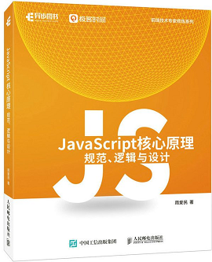
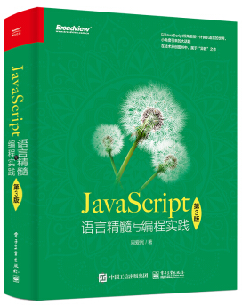

# 《JavaScript核心原理：规范、逻辑与设计》



在《JavaScript核心原理：规范、逻辑与设计》一书中的示例项目与代码。

本书的最初内容来自于《JavaScript核心原理解析》这门极客时间课程。因为是做语音讲解的缘故，所以正文中代码通常少且精炼。因此对于一般章节的内容，就不单独做测试用例了。但是如下章节中：

  * 第26章：并发与多线程
  * 第27章：并发在分布式环境中的应用

由于用到了仅复杂的示例，因此在本仓库中列出了它们的完整代码。

如果有需要，后续也可能添加其它章节的示例。敬请关注。

Issues区可以提交问题并发布勘误。

本书的相关信息
* 豆瓣：https://book.douban.com/subject/36479645
* 京东：https://item.jd.com/13800611.html
* 当当：http://product.dangdang.com/29601666.html


极客时间专栏：
* “JavaScript核心原理解析”：https://time.geekbang.org/column/intro/252

异步社区（人邮图书社区）：
* JavaScript核心原理：规范、逻辑与设计：https://www.epubit.com/bookDetails?id=UB83175664a0848


参考：

 * 《JavaScript语言精髓与编程实践》（绿皮书第三版）

[](https://book.douban.com/subject/35085910)

 * 《程序原本》

[](https://github.com/aimingoo/my-ebooks)


# Usage

在各示例代码目录中直接运行main.js即可。

```
> node main.js
...

```

# History

* 2023.07.13 Initial release, include chapter 26 and 27.
